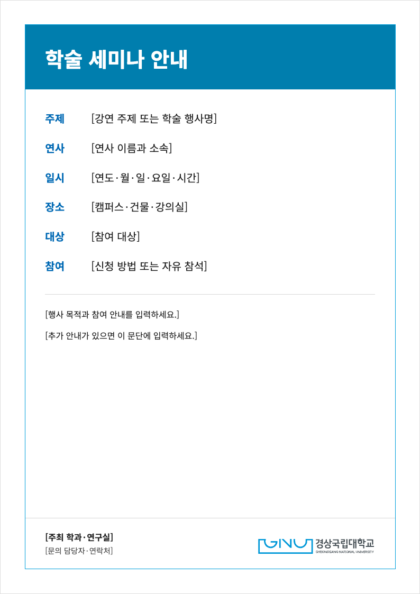

# GNU template

경상국립대학교 학교테마로 A4 홍보문·세미나 안내문, 학술포스터, 프레젠테이션, 간단한 웹페이지를 만드는 비공식 제작 도구입니다. 기본 결과는 **HTML·PDF·PNG 세 형식**입니다. 지누와 캐릭터는 포함하지 않습니다.

[디자인 지침](DESIGN.md) · [매체별 요청문](references/prompts.md) · [공식 자산 목록](assets/catalog.md) · [검증 기록](references/validation.md) · [색상·꽃 모티프 적용](references/brand-variants.md)

## 어떻게 사용하나요

이 폴더를 사용할 수 있는 AI에게 실제 내용과 함께 아래처럼 요청하세요. **HTML로 제작하고 PDF로 export하는 방법을 권장합니다.** PNG도 함께 저장합니다.

```text
GNU template을 적용해 아래 내용으로 A4 홍보문을 HTML로 만들어 주세요.
[행사 제목, 일시, 장소, 연사, 참여 방법, 문의처를 입력]
HTML, PDF, PNG로 모두 저장하고 글자와 로고가 잘리지 않는지 확인해 주세요.
```

```text
GNU template으로 첨부 연구 내용을 A0 세로 학술포스터로 만들어 주세요.
제공된 제목·저자·그림·수치를 사용하고 HTML, PDF, PNG로 저장해 주세요.
```

```text
GNU template으로 첨부 원고의 16:9 HTML 프레젠테이션을 만들어 주세요.
편집 가능한 HTML, 하나의 다쪽 PDF, 슬라이드별 PNG로 저장해 주세요.
```

```text
GNU template으로 우리 연구실의 간단한 웹페이지를 만들어 주세요.
[소개, 일정, 자료 링크, 문의처를 입력]
학교 홈페이지의 정보 안내 페이지처럼 구성하고 모바일에서도 확인해 주세요.
HTML, 전체 화면 PNG, 읽기용 PDF로 저장해 주세요.
```

‘회색 테마’, ‘공식 장미 프레임’, ‘철쭉 모티프’도 요청할 수 있습니다. 공식 자산의 완성 도안을 선택해 적용하며, 로고를 새로 그리거나 임의 채색하지 않습니다. 흰 바탕·청색 선이 기본형입니다.

예시의 `[입력 항목]`은 실제 사실로 바꿔 사용하세요. AI가 일정·연구 결과·연락처를 추측하게 하지 마세요. 그림·수식·QR이 필요하면 원본 그림이나 실제 주소를 함께 제공합니다.

## 예시 파일

| 제작물 | 수정할 HTML | PDF | PNG | 내용만 바꾸기 |
|---|---|---|---|---|
| A4 홍보문 | [flyer.html](examples/flyer.html) | [PDF](examples/flyer.pdf) | [PNG](examples/flyer.png) | [JSON](data/flyer.json) |
| A4 세미나 안내 | [seminar.html](examples/seminar.html) | [PDF](examples/seminar.pdf) | [PNG](examples/seminar.png) | [JSON](data/seminar.json) |
| A0 학술포스터 | [poster.html](examples/poster.html) | [PDF](examples/poster.pdf) | [PNG](examples/poster.png) | [JSON](data/poster.json) |
| 16:9 발표자료 | [slides.html](examples/slides.html) | [5쪽 PDF](examples/slides.pdf) | [표지](examples/slides-01.png) · [본문](examples/slides-03.png) | [JSON](data/slides.json) |
| 반응형 웹페이지 | [web.html](examples/web.html) | [PDF](examples/web.pdf) | [전체 PNG](examples/web.png) | [JSON](data/web.json) |



GitHub의 **Code → Download ZIP**으로 저장소를 내려받아 `templates/gnu-template` 폴더를 사용하면 됩니다.

HTML은 GitHub 화면에서 실행되지 않습니다. 저장소를 내려받아 해당 파일을 브라우저로 여세요. 각 예시는 스타일과 벡터 로고를 파일 안에 넣어 **단일 HTML 파일만으로 오프라인 열기**가 가능합니다. 발표자료에서는 ‘발표 보기’를 누른 뒤 방향키로 이동하고 Esc로 전체 목록에 돌아옵니다.

## Claude · Codex와 다른 AI

`SKILL.md`와 참조 자료는 표준 파일입니다. 특정 모델·유료 API·MCP를 요구하지 않습니다. 자동 호출과 실제 PDF·PNG 출력에는 해당 호스트의 파일 접근·실행 도구가 필요합니다.

- **Claude Code:** 이 `gnu-template` 폴더 전체를 `~/.claude/skills/gnu-template` 또는 프로젝트의 `.claude/skills/gnu-template`에 복사하고 `/gnu-template`으로 호출합니다. [공식 안내](https://code.claude.com/docs/en/skills)
- **Codex:** 폴더 전체를 `~/.agents/skills/gnu-template` 또는 프로젝트의 `.agents/skills/gnu-template`에 복사하고 `$gnu-template`으로 호출합니다. [공식 안내](https://learn.chatgpt.com/docs/build-skills)
- **Claude 웹앱:** 사용자 스킬 업로드가 가능한 환경에서는 이 폴더를 ZIP으로 압축해 스킬로 업로드합니다. 제공 여부는 계정·조직 설정을 따릅니다. [공식 안내](https://support.claude.com/en/articles/12512180-use-skills-in-claude)
- **프롬프트 첨부만 가능한 AI:** `DESIGN.md`와 사용할 예시 HTML을 첨부합니다. 로고·모티프가 필요하면 해당 파일도 전달합니다. Markdown만으로 모든 자산이 자동 전달되지는 않습니다.

저장소 전체 설치는 [루트 README](../../README.md)의 명령을 사용하세요. 별도 스킬로 압축할 때는 `SKILL.md`가 압축 폴더 최상위에 있는 `gnu-template` 폴더를 포함합니다. `node_modules`나 개인 작업 파일은 넣지 않습니다.

## 내용을 직접 바꾸기

브라우저에서 확인할 HTML만 만들 때는 Python 3.9 이상만 있으면 됩니다. 이 폴더에서 실행하세요.

```bash
python3 scripts/build.py flyer --data data/flyer.json --output out/flyer.html
```

`flyer`를 `seminar`, `poster`, `slides`, `web`으로 바꾸고 같은 이름의 JSON을 선택하면 됩니다. 원본 예시는 보관하고 JSON 사본을 편집하는 것을 권장합니다. `--no-logo`를 추가하면 로고 그림 대신 대학명을 텍스트로 표시합니다.

JSON 빌더는 텍스트와 그림 자리부터 만드는 시작 도구입니다. 실제 그림·수식·표는 생성된 HTML을 편집해서 넣습니다. 그림을 `data:` URI로 포함하거나 로컬 파일로 연결할 수 있으며, 공유할 때는 이미지가 함께 전달되는지 확인합니다. 다시 빌드하면 HTML의 직접 수정 내용은 덮어쓰므로 수정본을 따로 보관하세요.

## HTML · PDF · PNG로 저장하기

자동 내보내기를 쓰려면 **Node.js 20 이상**과 Playwright를 준비합니다. 이 폴더에서 한 번 설치하세요.

```bash
npm install
npx playwright install chromium
```

그 다음 실행합니다.

```bash
node scripts/export.mjs out/flyer.html out/flyer
```

기본적으로 같은 폴더에 HTML·PDF·PNG가 생깁니다. 슬라이드는 `slides.pdf` 한 파일과 `slides-01.png`, `slides-02.png` …로 저장합니다. `--scale=2`로 PNG를 두 배 크기로 만들 수 있습니다.

```bash
node scripts/export.mjs examples/slides.html out/slides --scale=2
```

이미 설치된 Google Chrome을 사용할 경우 macOS/Linux에서는 `GNU_BROWSER_CHANNEL=chrome`을 명령 앞에 붙일 수 있습니다. Windows PowerShell에서는 `$env:GNU_BROWSER_CHANNEL="chrome"`을 먼저 지정합니다. 기본값은 Playwright Chromium입니다.

스크립트는 원격 폰트·이미지 요청, 깨진 이미지, 글자 넘침을 확인합니다. 선택된 폰트와 이미지를 기다린 뒤 출력합니다. 출력 실패 메시지를 고친 후 다시 실행하세요. 내용이 길면 문장을 편집하거나 A4 페이지·슬라이드를 추가합니다. 작은 글자로 무리하게 압축하지 않습니다.

자동 도구를 쓰지 않는 경우 HTML을 브라우저로 열어 인쇄 → PDF 저장을 선택하세요. **배율 100%, 여백 없음, 배경 그래픽 켜기, 브라우저 머리말·꼬리말 끄기**를 기본으로 하고, 웹페이지의 읽기용 PDF는 CSS에 지정된 여백을 따릅니다. PNG는 브라우저의 페이지 캡처 도구로 저장할 수 있습니다.

PNG 기본값은 약 96dpi의 미리보기입니다. **대형 포스터 인쇄는 벡터 PDF를 권장합니다.** 300ppi PNG가 필요하면 인쇄 규격과 픽셀 크기를 별도로 계산해야 합니다. 예시 PDF는 RGB 출력이며 인쇄소의 CMYK·별색 작업을 대신하지 않습니다.

## 디자인과 자산

대학 VI의 Noto Sans KR·SUIT, 대학 웹의 Noto Sans KR·SUITE를 구분했습니다. 폰트 파일은 포함하지 않으며 설치되지 않은 환경에서는 시스템 한글 산세리프로 대체됩니다. 예시 출력은 macOS의 대체 서체로 확인했습니다. 필요한 서체를 설치하거나 허용된 폰트를 HTML에 포함한 다음 다시 출력하면 됩니다.

공식색은 GNU Blue `#009EDB`, Grey `#43525A`, Silver `#BCBEC0`, Gold `#B3A177`입니다. 작은 글자·버튼에는 대비를 확보한 별도 UI 색을 씁니다. 로고 원본의 색은 바꾸지 않습니다. 후크 메시지·버블·둥근 카드 반복 없이 제목·문단·표·직사각형 구획으로 구성합니다.

`assets/official/`에는 대학 공식 공개 페이지의 로고·시그니처·색상 견본·모티프·교화·안내문 AI/PDF/이미지를 보관했습니다. 출처와 해시는 `assets/manifest.json`, 선택 방법은 `assets/catalog.md`에 있습니다. 여러 도안이 들어 있는 견본 시트를 통째로 로고처럼 넣지 마세요.

이 저장소의 GPL-3.0은 대학 로고·상징·폰트 등의 제3자 권리를 새로 허락하는 라이선스가 아닙니다. 자산은 원 권리자의 이용조건을 따릅니다. 공식 기관 제작·승인을 받았다는 표시는 실제 사실이 있을 때만 사용합니다. 공식 규정·웹 관찰값·이 도구의 제안값은 [근거 문서](references/source-notes.md)에서 구분합니다.

## 확인한 범위

2026-10-04에 다섯 예시의 HTML·PDF·PNG를 실제 생성하고 화면과 PDF를 확인했습니다. A4 안내문 1쪽씩, A0 포스터 1쪽, 16:9 발표자료 5쪽과 페이지별 PNG를 점검했습니다. 웹페이지는 320·768·1360px 폭·200% 확대·키보드 이동을 확인했습니다. 실제 문장을 넣은 결과는 길이가 달라지므로 다시 확인해야 합니다. 다른 운영체제·Claude 환경에서 동일한 서체 출력까지 검증했다는 뜻은 아닙니다.
