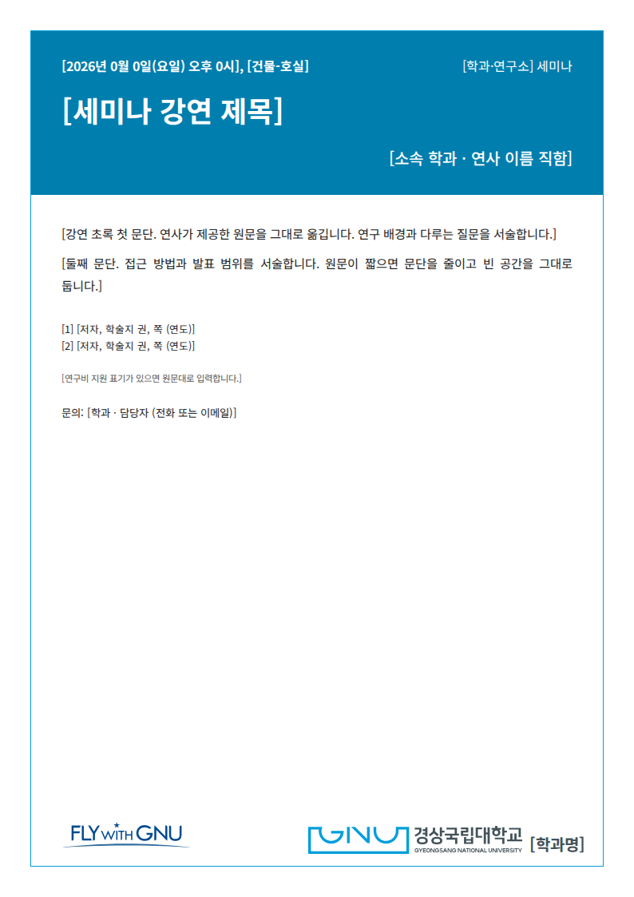
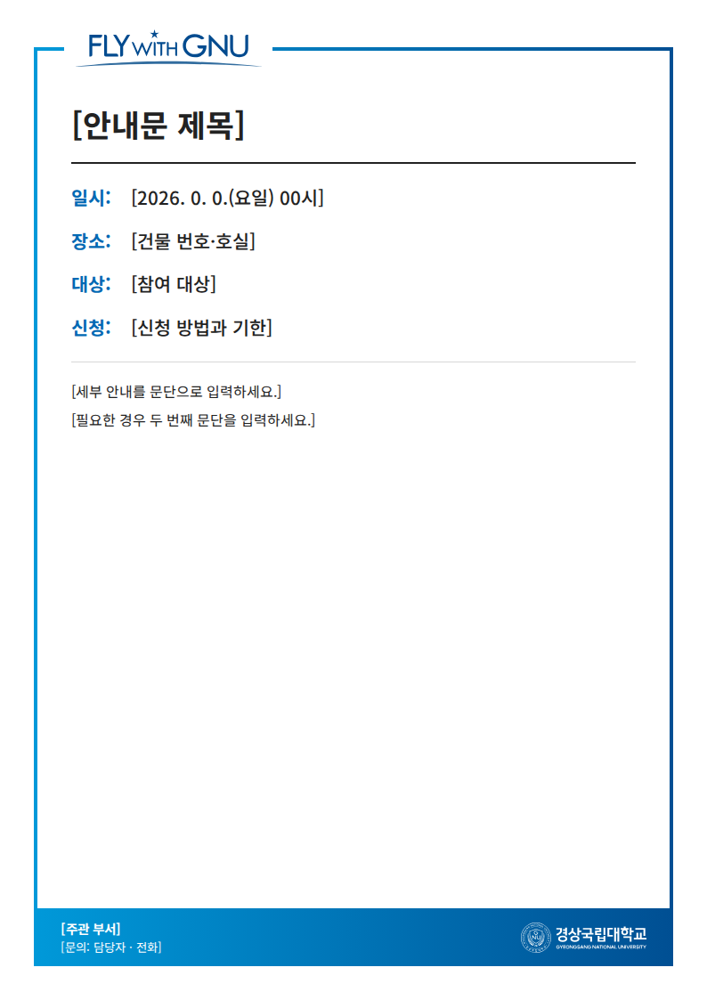
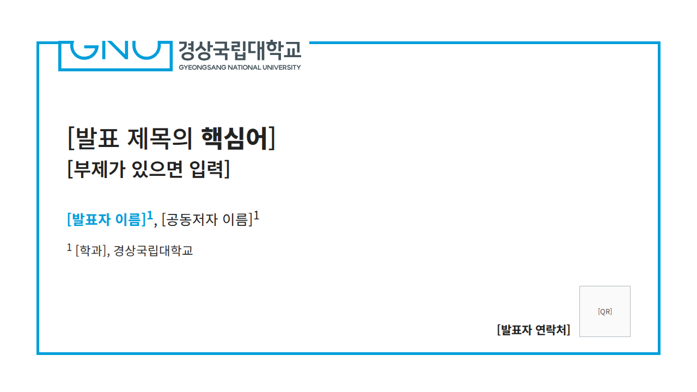
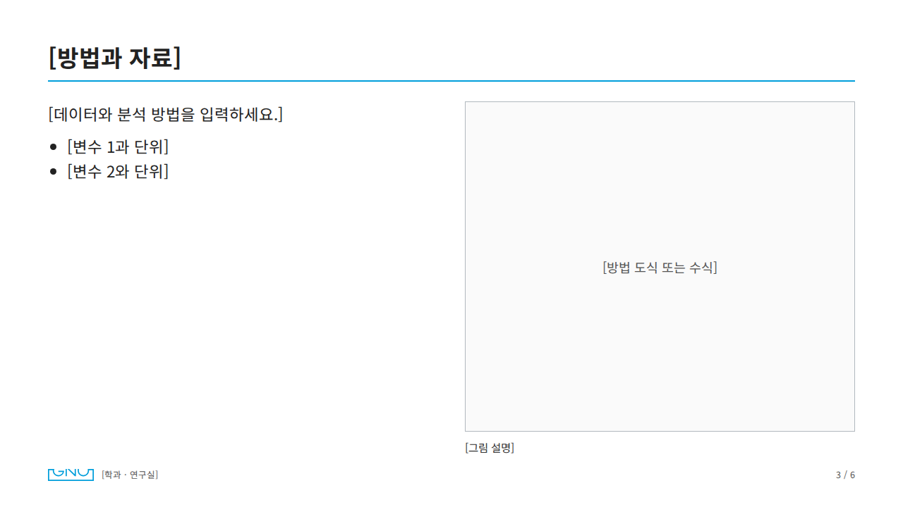

# GNU template

경상국립대학교 학교테마로 A4 홍보문·세미나 안내문, A0 학술포스터, 16:9 HTML 발표자료, 대학 홈페이지형 웹페이지를 만드는 도구입니다. 결과는 **HTML·PDF·PNG**로 저장합니다. 교내 구성원의 학술·공익 목적 제작을 돕는 비공식 자료입니다.

[디자인 지침 DESIGN.md](DESIGN.md) · [요청문 예시](references/prompts.md) · [공식 자산 목록](assets/catalog.md) · [캐릭터 지누](assets/character/README.md) · [검증 기록](references/validation.md)

| A4 세미나 안내 | A4 홍보문 | 공식 서식형 안내문 |
|---|---|---|
|  |  |  |

| 16:9 발표 표지 | 16:9 본문 |
|---|---|
|  |  |

A0 포스터와 웹페이지 미리보기: [poster.png](examples/poster.png) · [web.png](examples/web.png)

## 무엇이 들어 있나

- **학교 양식**: 학과 세미나 안내문의 청색 제목 띠와 하단 시그니처+학과명, 공식 안내문 서식(FLY WITH GNU·그라데이션 띠), 테두리 선이 GNU 심벌로 이어지는 발표·포스터 표지, 홈페이지 하위 페이지의 제목·경로·직사각형 탭·표.
- **공식 자산**: 대학 공개 VI 원본(AI·PDF·PNG)과 그중 필요한 로고를 원본 벡터 그대로 잘라 낸 SVG 4종.
- **서체**: Noto Sans KR(국문 지정서체), SUIT(영문 지정서체), SUITE(홈페이지 메뉴·제목). 모두 OFL이며 HTML에 포함되어 어느 PC에서나 같은 모양으로 출력됩니다.
- **캐릭터 지누·누누**: 공식 페이지에서 원본을 받아 오는 명령과 배치 자리, 사용 규칙. [아래 참고](#지누-캐릭터)
- **AI 티 줄이기**: 후크 문구·말풍선·둥근 카드·그라데이션 장식을 쓰지 않는 규칙과, 글자 넘침·그림 겹침을 잡는 출력 검사.

## AI에게 맡기기

### Claude Code · Codex · Gemini CLI

저장소 [루트 README](../../README.md)의 설치 블록을 실행하면 이 폴더가 각 도구의 스킬 폴더로 복사됩니다. 새 세션에서 호출합니다.

- Claude Code: `/gnu-template`
- Codex: `$gnu-template`
- Gemini CLI: 자연어로 “GNU template으로 …”

```text
/gnu-template 아래 내용으로 물리학과 세미나 A4 안내문을 만들어 줘. HTML·PDF·PNG로 저장해 줘.
일시·장소: [연월일(요일) 시각, 건물-호실]
제목: [강연 제목]
연사: [소속 · 이름]
초록: [원문 붙여넣기]
문의: [담당자 · 이메일]
```

### Claude 웹앱(claude.ai)

스킬 업로드가 켜진 계정이면 ZIP으로 올립니다. 설정 위치와 용량 제한은 [Claude 도움말](https://support.claude.com/en/articles/12512180-use-skills-in-claude)을 따릅니다.

```bash
python3 scripts/package.py --lite   # dist/gnu-template-lite.zip (Illustrator 원본·예시 PDF 제외)
python3 scripts/package.py          # dist/gnu-template.zip (전체)
```

스킬 업로드가 안 되면 **프로젝트 지식**이나 대화 첨부로 `DESIGN.md`와 가장 가까운 `examples/*.html`을 넣고 요청합니다. 이 경우 AI가 폰트·로고 파일을 직접 읽지 못하므로 결과 HTML을 이 폴더의 `examples/`에 저장해서 열거나 `node scripts/export.mjs`로 출력하면 학교 로고와 폰트가 적용됩니다.

### 다른 AI 채팅

`DESIGN.md` 한 파일만 붙여도 색·서체·배치 규칙과 최소 HTML 골격(8장)이 전달됩니다. 로고는 텍스트 자리로 나오므로 마지막에 `assets/derived/gnu-signature.svg`로 바꿉니다.

요청문은 실제 정보로 채웁니다. 일정·연구 결과·연락처를 AI가 추측하게 두지 마세요. 예시는 [references/prompts.md](references/prompts.md)에 매체별로 있습니다.

## 직접 만들기

필요한 것: Python 3.9 이상(빌드), Node.js 20 이상과 Playwright(PDF·PNG 출력).

```bash
cd templates/gnu-template
cp data/seminar.json my-seminar.json          # 내용을 편집
python3 scripts/build.py seminar --data my-seminar.json --output out/seminar.html
npm install && npx playwright install chromium   # 처음 한 번
node scripts/export.mjs out/seminar.html out/  # seminar.html · seminar.pdf · seminar.png
```

| 매체 | 명령의 매체 이름 | 내용 틀 |
|---|---|---|
| A4 홍보문 | `flyer` | [data/flyer.json](data/flyer.json) |
| A4 공식 서식형 안내문 | `flyer` | [data/notice-form.json](data/notice-form.json) |
| A4 세미나 안내 | `seminar` | [data/seminar.json](data/seminar.json) |
| A0 학술포스터 | `poster` | [data/poster.json](data/poster.json) |
| 16:9 발표자료 | `slides` | [data/slides.json](data/slides.json) |
| 웹페이지 | `web` | [data/web.json](data/web.json) |

내용 틀 작성법:

- 굵게 `**핵심어**`, 줄바꿈 `\n`, 문단 나눔 `\n\n`. 다른 HTML은 글자 그대로 표시됩니다.
- 홍보문의 `items`는 원하는 만큼 `{"label": "주제", "value": "…"}`를 추가·삭제합니다.
- 세미나 안내의 `style`은 `band`(기본, 대비 확보 청색 띠), `brand`(GNU Blue 띠, 띠 안 글자는 18pt 이상), `form`(공식 서식형).
- 포스터 `columns`의 개수가 단 수입니다. 그림은 `"figures": [{"src": "fig1.png", "caption": "Fig. 1. …"}]`, 빈자리 표시는 `"label"`. 남는 공간을 채울 섹션에 `"grow": true`.
- 저자는 `{"name": "…", "mark": "1", "presenter": true}`. 발표자는 청색 굵게 표시됩니다.
- QR은 실제 QR 이미지를 `"qr": {"src": "qr.png", "label": "발표자 연락처"}`로 넣습니다.
- 발표자료 `slides`의 `layout`은 `cover`, 일반(생략), `closing`. 그림이 있으면 오른쪽 단에 들어갑니다.

`--fonts link`는 폰트를 넣지 않고 `assets/fonts`를 가리키는 가벼운 HTML을 만듭니다(예시 파일이 이 방식). `export.mjs`가 저장하는 HTML에는 폰트가 다시 포함됩니다. `--no-logo`는 로고 대신 대학명 텍스트를 씁니다.

출력 검사는 외부 리소스, 깨진 그림, 글자 넘침, 종이 밖 글자, 로고·캐릭터가 글자를 가리는 경우를 찾아 멈춥니다. 내용이 넘치면 글자를 줄이기보다 문장을 다듬거나 쪽을 나누세요. Chrome을 쓰려면 `GNU_BROWSER_CHANNEL=chrome`, 특정 실행 파일은 `GNU_BROWSER_PATH=/경로`를 앞에 붙입니다.

브라우저로 직접 PDF를 만들 때는 배율 100%, 여백 없음, 배경 그래픽 켜기, 머리말·꼬리말 끄기. A0 포스터 인쇄는 벡터 PDF를 쓰고 CMYK 변환은 인쇄소 프로파일로 합니다.

## 지누 캐릭터

캐릭터 원본은 저장소에 아직 들어 있지 않을 수 있습니다. 학교 사이트에 접속되는 PC에서 한 번 실행하면 공식 페이지의 내려받기 파일을 `assets/character/official/`에 저장하고 출처·SHA-256을 기록합니다.

```bash
python3 scripts/assets.py --fetch-character --dry-run   # 목록 확인
python3 scripts/assets.py --fetch-character
```

AI 원본에서 한 자세를 SVG로 잘라 넣는 방법과 규칙은 [assets/character/README.md](assets/character/README.md), [DESIGN.md 6장](DESIGN.md#6-캐릭터-지누누누)에 있습니다. 한 쪽에 한 자세, 오른쪽 아래, 말풍선·대사·재작화·반전·색 변경 없이 씁니다.

## 권리와 범위

이 폴더의 코드·문서는 저장소의 GPL-3.0을 따릅니다. 대학 로고·슬로건·교화·캐릭터는 경상국립대학교의 자산이며 이 라이선스가 그 이용을 허락하지 않습니다. 서체는 각 OFL을 따릅니다. 대학 명의 공식 홍보물이나 상업적 사용은 담당 부서와 협의하세요. 공식 규정·홈페이지 관찰값·이 도구의 제안값은 [근거 기록](references/source-notes.md)에서 구분합니다.

이 도구는 학교의 공식 승인 도구가 아닙니다. 확인 범위는 [검증 기록](references/validation.md)에 있습니다.
